## 개요

클라우드포레의 컬렉터 등록하기 위한 다음 세 가지 작업이 선행되어야 합니다.

- [사용자 설정](https://spaceone.org/ko/docs/guides/getting-started/#%EC%82%AC%EC%9A%A9%EC%9E%90-%EC%84%A4%EC%A0%95)
- [프로젝트 설정](https://spaceone.org/ko/docs/guides/project/project-group/#%ED%94%84%EB%A1%9C%EC%A0%9D%ED%8A%B8-%EA%B7%B8%EB%A3%B9-%EC%83%9D%EC%84%B1%ED%95%98%EA%B8%B0)
- 서비스 계정 설정

각 프로바이더별 서비스 계정 등록 방법은 여기(링크)를 참고 하십시오.

## AWS Cloud Services collector 생성

(1) [에셋 인벤토리 > 컬렉터] 페이지로 이동합니다.

(2) [생성] 버튼을 클릭합니다.

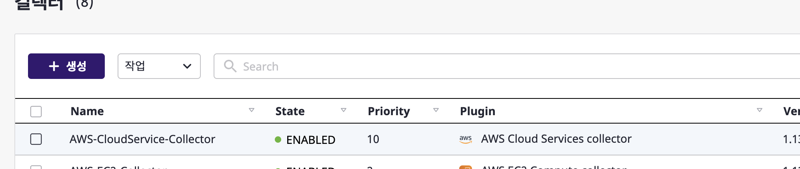

(3) 플러그인 저장소로 [Official Marketplace]를 클릭합니다.

(3-1) 검색 창에서 aws-cloud-services를 입력하여 조건에 부합하는 컬렉터 플러그인 목록을 확인할 수 있습니다.

(3-2) [생성] 버튼을 클릭합니다.

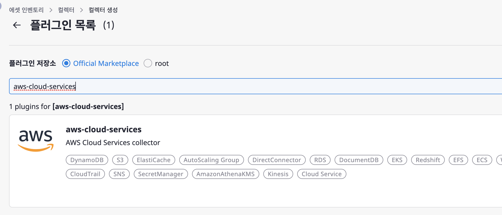

(4) [컬렉터 설정] 탭에서 컬렉터 설정 폼을 작성합니다.

(4-1) [다음] 버튼을 클릭합니다.

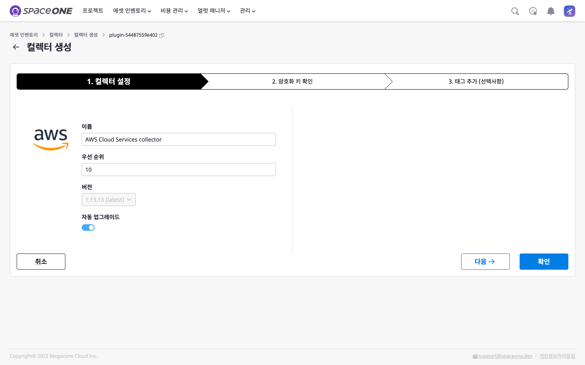

(5) [암호화 키 확인] 탭에서 암호화 키 정보를 확인 후 [다음] 버튼을 클릭합니다.

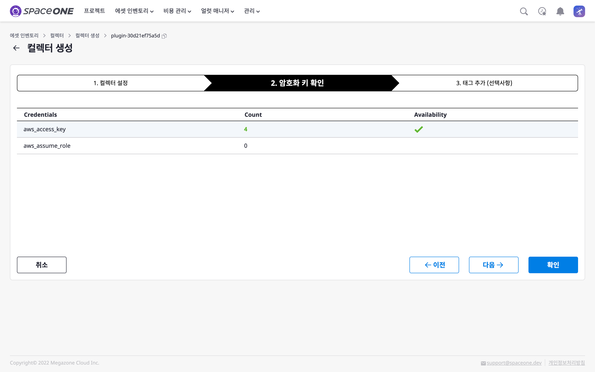

(6) 필요한 경우, [태그 추가] 탭에서 컬렉터에 대한 추가 정보를 입력합니다.
(6-1) [확인] 버튼을 클릭합니다.

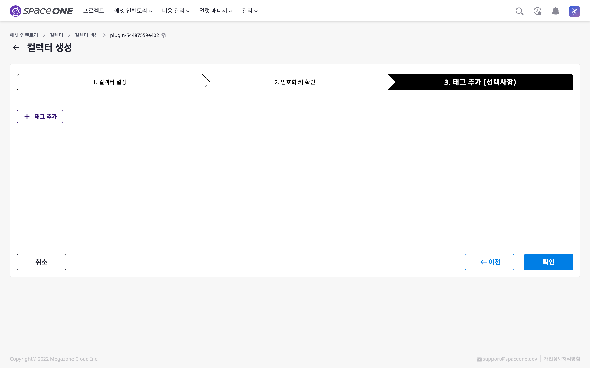

## 컬렉터로 데이터 수집

(1) [에셋 인벤토리 > 컬렉터] 페이지로 이동합니다.

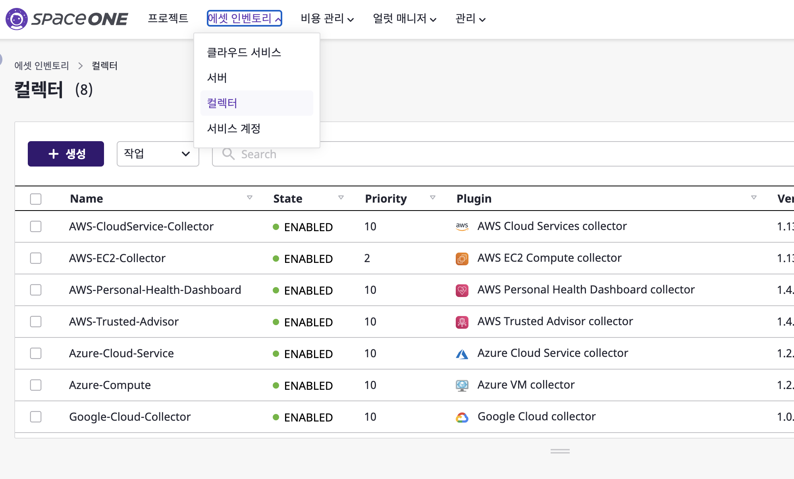

(2)[위 과정](#aws-cloud-services-collector-생성)에서 생성한 **AWS Cloud Services collector**를 클릭합니다.

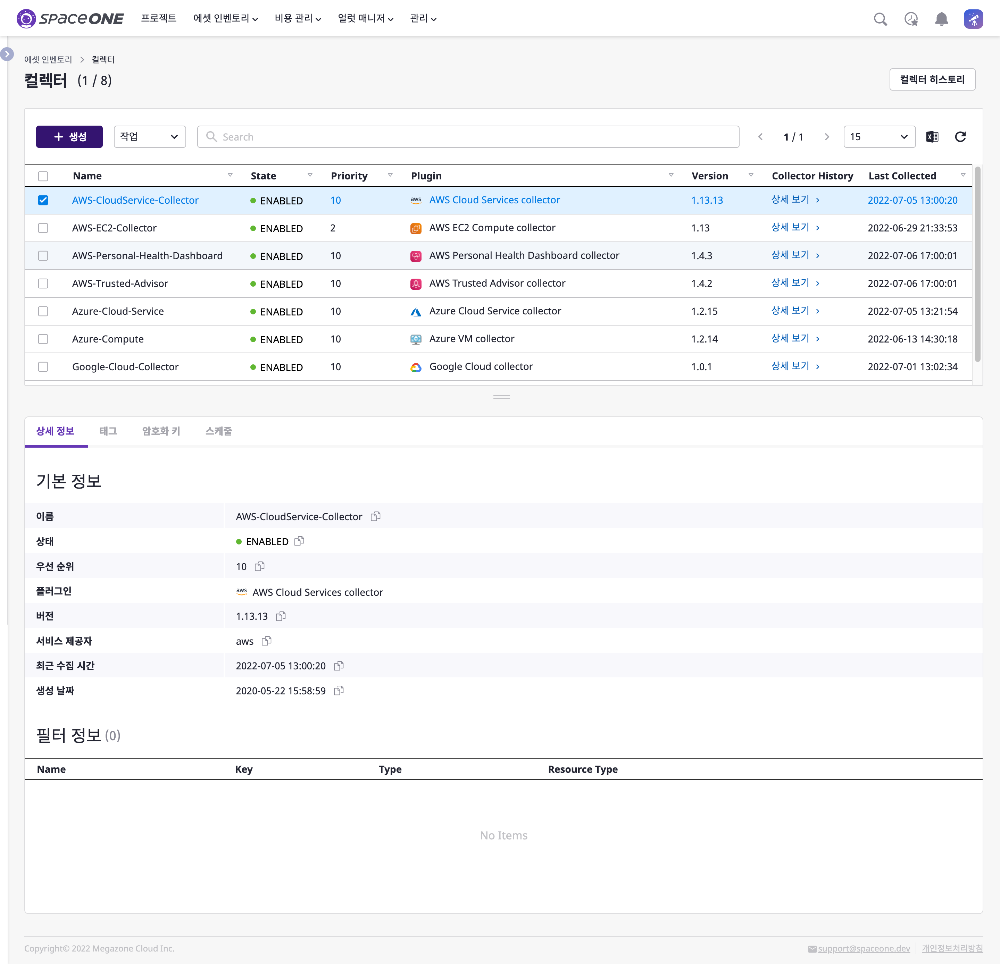

(3) [작업 > 데이터 수집]을 클릭합니다.

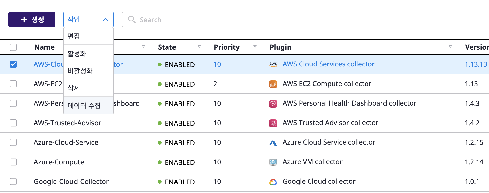

(3-1) 데이터 수집을 시작하기 위해 [확인] 버튼을 클릭합니다.

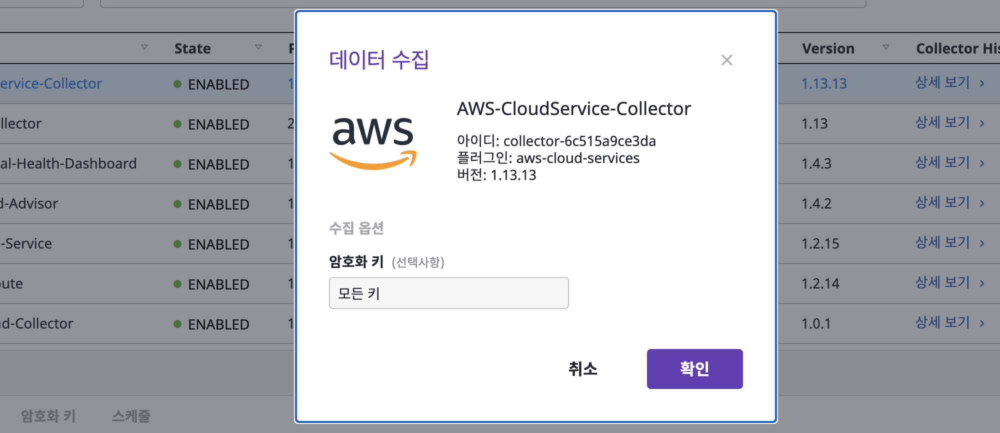

(4) [상세보기]를 클릭하여 컬렉터의 진행 사항을 확인합니다.

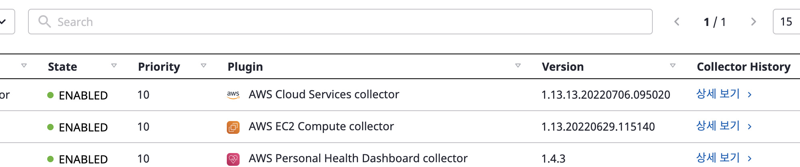

(4-1) 데이터 수집이 완료 되면 데이터 수집 성공 여부와 소요 시간을 확인 할 수 있습니다.

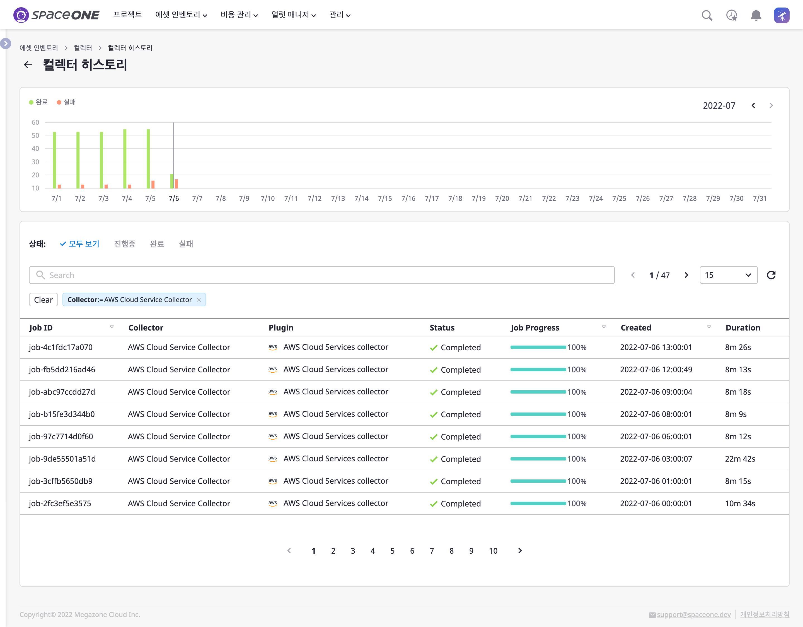